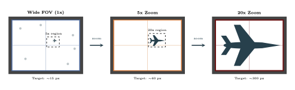
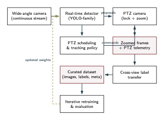
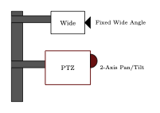
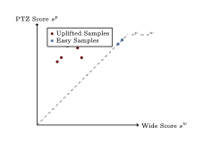
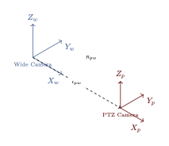
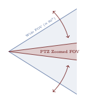
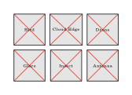

# Figure Improvement Plan

## 🚀 Priority Summary (Fix These First)

1.  **`fig_pipeline`**: This is likely the "main" figure explaining your method. Currently, it's a generic flowchart. It needs a modern, structured layout with clear groupings (Data Ingestion, Processing, Output) and professional styling to immediately convey the system architecture.
2.  **`fig_hardware_setup`**: The current schematic is too abstract. It needs to look like a realistic physical setup (tripod/mast, distinct camera bodies, mounting plate) to ground the work in reality.
3.  **`fig_confidence_uplift`**: This data plot uses random numbers (`rand`) for generation, making it scientific nonsense if recompiled. It needs fixed data points (or a fixed seed), clear axis units, and a professional legend.

---

## ✅ Completed Figures

### `fig_zoom_comparison`

*   **Status**: **FIXED** (Option F).
*   **Notes**: Updated with clear top-down aircraft silhouettes, removed confusing markings, strict scaling (1x, 5x, 20x), and clean "camera viewfinder" aesthetic.

---

## 🛠 Detailed Analysis & Action Items

### 1. `fig_pipeline`

*   **Critique (Bad)**:
    *   Looks like a basic 1990s flowchart.
    *   Dashed "Previous Frame" loop is cramped and hard to follow.
    *   No visual separation between logical stages (e.g., Detection vs. Slew Control).
*   **Action Items**:
    *   Use distinct color-coded regions (background blocks) for *Wide Detector*, *Slew Logic*, and *PTZ Identifier*.
    *   Straighten arrows and use orthogonal routing (horizontal/vertical lines only).
    *   Add small icons to blocks (e.g., specific icon for "YOLOv5", "PID Controller").

### 2. `fig_hardware_setup`

*   **Critique (Bad)**:
    *   Very primitive "stick figure" style.
    *   Cameras are just rectangles; doesn't show the physical relationship (e.g., Wide usually static, PTZ can rotate).
    *   Dimensions are missing.
*   **Action Items**:
    *   Draw identifiable camera shapes (lens barrel, body).
    *   Show a proper mounting bracket or tripod.
    *   Add a subtle ground plane or mount pole for context.
    *   Label the baseline distance between cameras clearly.

### 3. `fig_confidence_uplift`

*   **Critique (Bad)**:
    *   **Major Issue**: Uses `rand` function in TikZ. Every compile gives a different plot!
    *   Axes have no tick marks or numeric labels (0.0 to 1.0).
    *   Legend overlay covers the data area.
*   **Action Items**:
    *   Hard-code the coordinate points or read from a CSV so the figure is reproducible.
    *   Add proper axis ticks (0, 0.2, ... 1.0) and grid lines.
    *   Move the legend outside the plot area or to a dedicated empty corner.

### 4. `fig_zoom_focal`

*   **Critique (Bad)**:
    *   A bare curve with no context.
    *   Missing axis labels, units, and tick marks.
    *   "Current" dashed lines float with no specific values attached.
*   **Action Items**:
    *   Add axis calibration (Zoom Steps 0-100, Focal Length 0-500mm).
    *   Add markers for key zoom levels used in the paper (1x, 5x, 20x).
    *   Make the curve thicker and smoother.

### 5. `fig_coord_frames`

*   **Critique (Bad)**:
    *   Standard geometric diagram but lacks "real world" anchoring.
    *   The transform vector $t_{pw}$ is just a line; doesn't convey 3D depth well.
    *   Labels are floating.
*   **Action Items**:
    *   Add faint outlines of the camera bodies around the coordinate origins ($O_w$, $O_p$) so the reader knows *why* there are two frames.
    *   Use color coding: Blue for Wide Camera frame, Red for PTZ Camera frame.

### 6. `fig_fov_comparison`

*   **Critique (Bad)**:
    *   The "cones" are simple triangles.
    *   The "Steering" arrows are confusing arcs.
    *   Doesn't visually demonstrate that the PTZ view is *inside* the Wide view.
*   **Action Items**:
    *   Show the Wide FOV as a large semi-transparent cone.
    *   Show the PTZ FOV as a narrower, darker cone *inside* it, pointing at a target.
    *   Add a target plane to show what the camera is actually looking at.

### 7. `fig_hard_negatives`

*   **Critique (Bad)**:
    *   Just gray boxes. Tells the reader nothing about *what* a hard negative is (e.g., a bird, a cloud, a reflection).
    *   "Text" labels inside boxes are ugly.
*   **Action Items**:
    *   If actual images aren't available, draw representative icons (e.g., a simple cloud shape, a bird silhouette, a glare starburst) inside the boxes.
    *   Style it like a "Failed Detection" gallery.
