# Where the solutions come from.

The course notes contain the analytical basis for every HW01 topic and closely follow many of the analysis questions. They are not a complete worked numerical answer key. The supplied original homework is labeled “Solution” in its running header, but the inspected problem pages contain prompts rather than completed numerical solutions. This guide supplies the intermediate reasoning, calculations, and plots, including the graduate and optional challenge work.

All note references below use the PDF page position in the 265-page file, not the smaller page numbers printed inside individual sections. The two source documents are `EMCH574_CourseNotes_20260826.pdf` in the lectures directory and `HW01_EMCH574_original.pdf` in the HW01 directory. The latter controls interpretation of the original beam cross sections.

| HW01 problem | Course-note PDF pages | What is present and what must be supplied. |
|---|---|---|
| A.1 | 5–9 | Direct pendulum derivation, characteristic roots, and initial conditions. |
| A.2 | 6, 8–10 | Frequency, period, and displacement-release formulas. Calculate the ten-length table and averages. |
| A.3 | 5–9 | Pendulum response after the initial velocity is known. Add a short-duration impact momentum balance. |
| B.1 | 17–20 | Direct free-body diagram, governing equation, roots, and initial-value solution. |
| B.2 | 29–35 | Direct damped-system derivation, damping definitions, and underdamped initial-value solution. |
| B.3 | 29–35 | Apply the damped solution numerically. Determine the final 2% crossing separately. |
| B.4 | 29–35, 249, 251 | Combine damping theory with a simply supported beam under a center load. |
| B.5 | 35–39 | Direct overdamped and critically damped solutions, including verification. |
| B.6 | 39–48 | Direct forced response, normalized frequency response, magnitude, phase, and resonance. |
| B.7 | 39–48, 247, 250 | Combine cantilever stiffness with the forced-response formulas. |
| B.8 | 17–20, 247, 250 | Combine cantilever stiffness, impact momentum, and the velocity-release solution. |
| C.1 | 20–22 | Direct equilibrium shift and vertical spring derivation. Generalize the force projection. |
| C.2 | 20–22, 247–250 | Combine vertical equilibrium with cantilever stiffness. |
| C.3–C.4 | 17–20, 247, 250 | Replace the spring by the correctly oriented beam stiffness. |
| C.5 | 23–26 | Direct suddenly applied load derivation and twice-static maximum. |
| C.6 | 23–26, 247–248, 250 | Combine step response, beam root stress, and yield safety factor. |
| C.7 | 252 | Direct handwritten flex-beam pendulum approximation. |
| C.8 | 252, 8–9 | Combine that approximation with impact momentum. |
| C.9 | 7, 13–16, 19 | Euler representation, unit circle, and phase. Work out the requested roots and angles. |

The source map distinguishes a derivation already present from a numerical application assembled here. The short-duration projectile collision is an additional mechanics step, not a worked impact solution located in the cited note pages.

## Corrections and conventions that affect the answers.

On page 21, the expansion of $mg-k(\delta_{\rm st}+u)$ must contain $-ku$. The intermediate positive signs in equations (29)–(30) are inconsistent with the force balance. The final governing equation $m\ddot u+ku=0$ is correct.

On page 46, the condition for losing an interior displacement-magnification peak is $\zeta\geq1/\sqrt{2}$, not $\zeta\geq\sqrt{2}$. It follows immediately from $\omega_r=\omega_n\sqrt{1-2\zeta^2}$.

In B.7(2c), the quasi-static limit is excitation frequency $\omega\to0$ while the structure remains fixed. The printed $\omega_n\to0$ would instead change the structure and does not express the intended limit.

Use $\operatorname{atan2}$ for phase. An ordinary inverse tangent of a ratio loses quadrant information. Here the amplitude-phase convention is $C\sin(\omega_d t+\phi)$, so $\phi=\operatorname{atan2}(A,B)$ when the cosine and sine coefficients are $A$ and $B$.

Use full precision internally. Round only displayed results to three significant digits, or four when the leading digit is one. Input dimensions are retained as given. SI denotes the International System of Units. Convert millimetres to metres, grams to kilograms, gigapascals to pascals, and millinewtons to newtons before calculation. Tables and plots convert the final values to convenient engineering units.

# A. Pendulum.

## A.1. From the free-body diagram to the response.

Assume a point mass, a massless inextensible rod or taut string of length $L$, a fixed frictionless pivot, uniform gravity, planar motion, and negligible air resistance. Measure $\theta$ from the downward vertical. Let $u=L\theta$ be arc displacement. This relation is exact for arc displacement; horizontal displacement is $L\sin\theta\approx u$ only for small angles.

The free-body diagram has weight $mg$ downward and tension $T$ toward the pivot. Tension has no tangential component. Gravity contributes the restoring tangential force $-mg\sin\theta$. Newton's law of motion therefore gives

$$mL\ddot\theta=-mg\sin\theta.$$

For $|\theta|\ll1$ in radians, $\sin\theta\approx\theta$, so the linear equation of motion and its mass-normalized governing equation are

$$mL\ddot\theta+mg\theta=0,\qquad
\ddot\theta+\frac{g}{L}\theta=0.$$

Substitute $\theta=e^{st}$ and use $\ddot\theta=s^2e^{st}$. Since the exponential is nonzero, its coefficient must vanish. The characteristic equation is

$$s^2+\frac{g}{L}=0.$$

Define the natural angular frequency $\omega_n=\sqrt{g/L}$. The roots are the purely imaginary pair $s_1=i\omega_n$ and $s_2=-i\omega_n$. Thus the angular solution can be written in either equivalent form

$$\theta(t)=D_1e^{i\omega_nt}+D_2e^{-i\omega_nt}
=A_\theta\cos(\omega_nt)+B_\theta\sin(\omega_nt).$$

The frequency in hertz and oscillation period are

$$f_n=\frac{\omega_n}{2\pi},\qquad \tau=\frac{2\pi}{\omega_n}.$$

Multiplication by $L$ gives the particle-motion solution

$$u(t)=C_1e^{i\omega_nt}+C_2e^{-i\omega_nt}
=A\cos(\omega_nt)+B\sin(\omega_nt).$$

To solve the initial value problem, evaluate both displacement and its derivative at zero. This gives $u(0)=A=u_0$ and $\dot u(0)=\omega_nB=v_0$, where $v_0=\dot u_0$. Therefore

$$\boxed{u(t)=u_0\cos(\omega_nt)+\frac{v_0}{\omega_n}\sin(\omega_nt).}$$

A displacement release sets $v_0=0$ and gives a cosine. A velocity release sets $u_0=0$ and gives a sine. Applying both initial conditions gives their sum. In exponential form the same constants are

$$C_1=\frac12\left(u_0-\frac{iv_0}{\omega_n}\right),\qquad
C_2=\frac12\left(u_0+\frac{iv_0}{\omega_n}\right).$$

Mass cancels because it multiplies both inertia and weight. A heavier ideal pendulum has the same small-angle frequency at the same length. This does not mean mass cancels from an impact calculation.

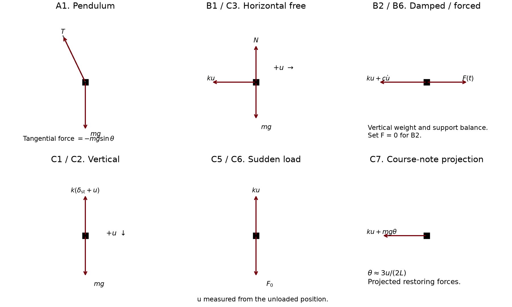{width=100%}

## A.2. Ten manufactured lengths and an initial displacement.

The inputs are $g=9.81\ \mathrm{m/s^2}$, nominal length $565\ \mathrm{mm}$, mass $52\ \mathrm{kg}$, $u_0=2\ \mathrm{mm}$, and $v_0=0$. For each actual length, calculate $\omega_{n,j}=\sqrt{g/L_j}$, then $f_{n,j}=\omega_{n,j}/(2\pi)$ and $\tau_j=2\pi/\omega_{n,j}$.

{{A2_lengths}}

The means are arithmetic means of the individually calculated quantities. The required representative response is

$$u(t)=0.002\cos(\overline{\omega_n}t)\ \mathrm{m}.$$

Insert $t=10\ \mathrm{s}$ directly into this expression. For the assignment's duration convention, set $t_{10}=10\overline\tau$ and evaluate the same response there.

{{A2}}

Because reciprocation is nonlinear, $\overline\tau$ is not exactly $2\pi/\overline{\omega_n}$. Consequently $10\overline\tau$ is not exactly ten cycles of the mean-frequency surrogate, although the difference is negligible at the requested display precision. Both durations are reported rather than silently treating the two averaging operations as identical. The surrogate is also not exactly the ensemble mean response, which would be $\frac1{10}\sum_j u_0\cos(\omega_{n,j}t)$.

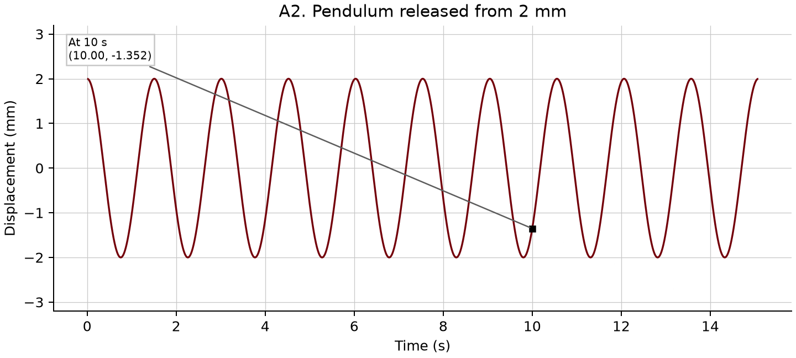{width=95%}

## A.3. Initial velocity from an embedded projectile.

The inputs are $L=0.565\ \mathrm m$, $M=52\ \mathrm{kg}$, projectile mass $m_p=0.022\ \mathrm{kg}$, projectile speed $v_p=945\ \mathrm{m/s}$, and $g=9.81\ \mathrm{m/s^2}$. The target starts at rest and the projectile remains embedded.

Separate the very short collision from the subsequent vibration. During impact, conserve angular momentum about the pivot. For a tangential projectile at the bottom, the common lever arm $L$ cancels, giving

$$m_pv_pL=(M+m_p)v_0L,\qquad
v_0=\frac{m_pv_p}{M+m_p}.$$

This is a perfectly inelastic collision. Kinetic energy is not conserved during embedding. After the collision, use the total moving mass $M+m_p$, although that mass still cancels from the ideal pendulum frequency. Since $u_0=0$,

$$u(t)=\frac{v_0}{\omega_n}\sin(\omega_nt),\qquad
u_{\max}=\frac{v_0}{\omega_n},\qquad t_{\rm first\ peak}=\frac{\tau}{4}.$$

{{A3}}

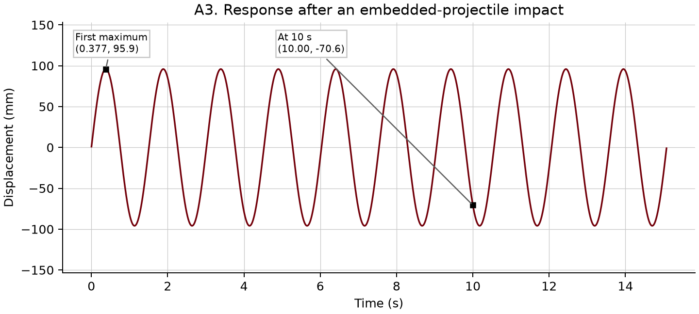{width=95%}

The linear amplitude corresponds to about ten degrees, so it is useful to check the small-angle approximation. After impact, conservation of mechanical energy in the exact pendulum gives

$$\frac12v_0^2=gL(1-\cos\theta_{\max}).$$

Numerical integration of $\ddot\theta+(g/L)\sin\theta=0$ provides an additional comparison. Both curves below use arc displacement $L\theta$, so their difference measures the linearization rather than a change of coordinate.

{{A3_accuracy}}

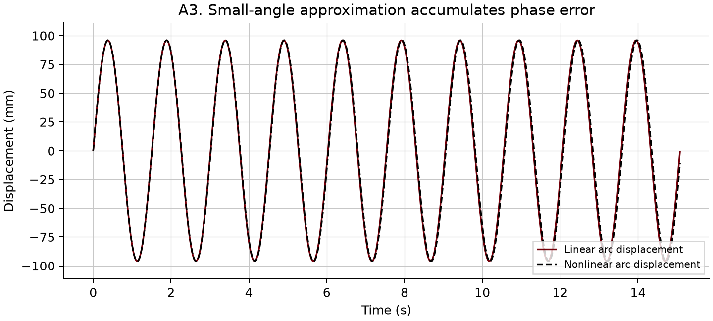{width=95%}

Even a small frequency error accumulates phase error over many oscillations. The homework's linear result is the requested result; the extra comparison shows how well its assumptions work.

# B. Spring, mass, and damper systems.

## B.1. Undamped horizontal spring.

Assume one degree of freedom, a point mass, a massless linear spring, frictionless horizontal motion, and displacement measured from equilibrium. Weight and the vertical support reaction balance. The only horizontal force is the spring reaction $-ku$. The free-body diagram above therefore gives

$$\sum F_x=-ku=m\ddot u,\qquad m\ddot u+ku=0.$$

Divide by $m$ and substitute $u=e^{st}$ to obtain

$$s^2+\frac{k}{m}=0,\qquad
\omega_n=\sqrt{\frac{k}{m}},\qquad s_{1,2}=\pm i\omega_n.$$

These are purely imaginary roots. The exponential and trigonometric solutions, including their initial-condition constants, are exactly those derived in A.1 with this new definition of $\omega_n$. In particular,

$$u(t)=C_1e^{i\omega_nt}+C_2e^{-i\omega_nt}
=u_0\cos(\omega_nt)+\frac{v_0}{\omega_n}\sin(\omega_nt).$$

The displacement-only, velocity-only, and combined cases follow by setting the unused initial condition to zero. This reuse is the main connection between the pendulum and spring problems. Both become the same normalized ordinary differential equation.

## B.2. What viscous damping changes.

Retain the B.1 assumptions and add a massless viscous damper whose force opposes relative velocity. For a fixed support, its force on the mass is $-c\dot u$. With no external excitation, the force balance and characteristic equation become

$$m\ddot u+c\dot u+ku=0,\qquad ms^2+cs+k=0.$$

The quadratic formula gives

$$s_{1,2}=\frac{-c\pm\sqrt{c^2-4mk}}{2m}.$$

Critical damping occurs when the discriminant is zero. Define

$$c_{\rm cr}=2\sqrt{mk}=2m\omega_n,\qquad
\zeta=\frac{c}{c_{\rm cr}},\qquad c=2\zeta\sqrt{mk}.$$

For physical nonnegative damping, $0<\zeta<1$ is underdamped, $\zeta=1$ is critically damped, and $\zeta>1$ is overdamped. The special case $\zeta=0$ is undamped. The normalized equation and roots are

$$\ddot u+2\zeta\omega_n\dot u+\omega_n^2u=0,\qquad
s_{1,2}=-\zeta\omega_n\pm\omega_n\sqrt{\zeta^2-1}.$$

For the underdamped case define $\alpha=\zeta\omega_n$ and $\omega_d=\omega_n\sqrt{1-\zeta^2}$. The roots are $-\alpha\pm i\omega_d$. Substitution into the exponential solution exposes its decaying envelope,

$$u(t)=C_1e^{s_1t}+C_2e^{s_2t}
=e^{-\alpha t}\left(C_1e^{i\omega_dt}+C_2e^{-i\omega_dt}\right)
=e^{-\alpha t}[A\cos(\omega_dt)+B\sin(\omega_dt)].$$

At zero time, $u_0=A$. Differentiating before setting time to zero gives $v_0=-\alpha A+\omega_dB$. Hence

$$A=u_0,\qquad B=\frac{v_0+\alpha u_0}{\omega_d},$$

and the complete initial-value solution is

$$\boxed{u(t)=e^{-\alpha t}\left[u_0\cos(\omega_dt)
+\frac{v_0+\alpha u_0}{\omega_d}\sin(\omega_dt)\right].}$$

For a displacement release, set $v_0=0$. The sine term remains necessary to make the initial velocity zero. Simply multiplying $u_0\cos(\omega_dt)$ by an exponential gives the wrong initial derivative.

To convert forms, use

$$C_1=\frac{A-iB}{2},\qquad C_2=\frac{A+iB}{2},\qquad
C=\sqrt{A^2+B^2},\qquad \phi=\operatorname{atan2}(A,B).$$

Then $u(t)=Ce^{-\alpha t}\sin(\omega_dt+\phi)$. Sketch a sinusoid bounded by $\pm Ce^{-\alpha t}$. Its successive peaks shrink while the damped period $\tau_d=2\pi/\omega_d$ remains constant. The B.3 plot illustrates this behavior. The envelope intercept $C$ need not equal an attained displacement peak.

## B.3. Numerical damped response and the 2% criterion.

The inputs are $m=12\ \mathrm{kg}$, $k=655\ \mathrm{N/m}$, $c=19\ \mathrm{N\,s/m}$, $u_0=3.5\ \mathrm{mm}$, and $v_0=0$. Calculate $\omega_n$, $c_{\rm cr}$, $\zeta$, and $\omega_d$ in that order. Insert them into the B.2 solution. The table includes both exponential and trigonometric constants.

{{B3}}

For one complete damped cycle, $\cos(\omega_d\tau_d)=1$ and $\sin(\omega_d\tau_d)=0$, so

$$u(\tau_d)=u_0e^{-\alpha\tau_d}.$$

For this displacement-release problem, the largest absolute displacement is the initial value. The subsequent stationary points occur at $t_n=n\pi/\omega_d$ with decreasing magnitudes $|u_0|e^{-\alpha t_n}$.

The 2% settling time means the earliest time after which every future displacement satisfies $|u(t)|\leq0.02|u_0|$. It is not the first time the oscillation enters that band, and it is not a zero crossing. Locate the last extremum above the band, then solve the falling side of that lobe for the exact final crossing. Because all later extrema are smaller, this proves the response stays inside the band.

An easier sufficient bound comes from the exponential envelope. For this zero-velocity release,

$$t_{\rm envelope}=\frac{1}{\alpha}
\ln\left(\frac{1}{0.02\sqrt{1-\zeta^2}}\right).$$

The familiar approximation $4/(\zeta\omega_n)$ is not an exact last-crossing calculation. Both the exact result and the envelope bound appear in the table.

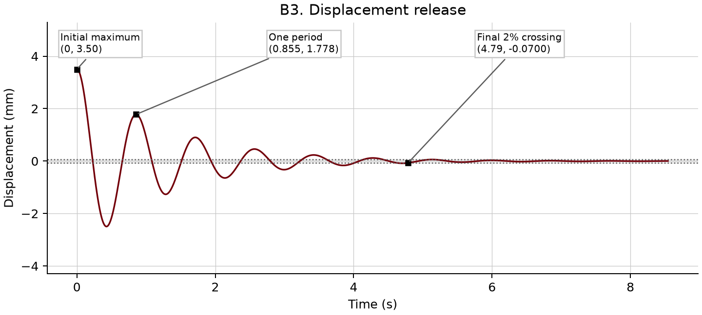{width=95%}

## B.4. Truck suspension and a worn damper.

The inputs are $L=0.830\ \mathrm m$, $b=0.065\ \mathrm m$, $h=0.003\ \mathrm m$, $E=200\ \mathrm{GPa}$, $m=457\ \mathrm{kg}$, $u_0=0.125\ \mathrm m$, and $v_0=0$. Use $\zeta=0.25$ for the initial case and $\zeta=0.10$ for the worn damper.

Treat the leaf spring as the equivalent simply supported beam with a center load and full support span $L$. This is the boundary-condition assumption consistent with the spring-eye supports and the note formula on pages 249 and 251. Its center deflection under load $P$ is $PL^3/(48EI)$, so

$$I=\frac{bh^3}{12},\qquad EI=E I,\qquad
k=\frac{P}{\delta}=\frac{48EI}{L^3}.$$

Do not use the cantilever factor of three here. The stiffness depends on the support conditions as well as the material and section dimensions.

{{B4_beam}}

Now use the same B.2 formulas as before. For the original damper the numerical results are

{{B4_healthy}}

For the worn damper the spring and mass are unchanged. Therefore $\omega_n$ and $c_{\rm cr}$ are unchanged, while $c$, $\omega_d$, the roots, the constants, and the decay change.

{{B4_worn}}

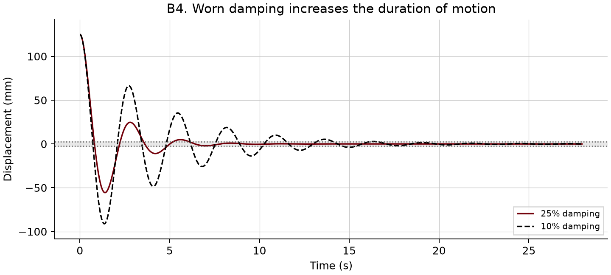{width=95%}

The worn damper permits more oscillation before settling. Its damped period is slightly shorter because damping lowers oscillation frequency. Both cases begin at the same largest displacement, so the relevant comparison is persistence and subsequent extrema rather than the initial peak.

The given single 3 mm uniform beam is an educational equivalent. Its predicted static deflection $mg/k$ is very large for a truck suspension, and the imposed displacement is also large relative to the beam span. The calculation is a formal small-deflection, linear response about an assumed equilibrium. A physical design would require the actual leaf stack, geometry, stiffness, and available travel.

## B.5. Overdamping and critical damping.

The inputs are $f_n=6.25\ \mathrm{Hz}$, $u_0=13\ \mathrm{mm}$, $v_0=0$, and a time interval from zero to three seconds. First calculate $\omega_n=2\pi f_n$.

For $\zeta>1$, the roots are distinct negative real numbers,

$$s_{1,2}=-\omega_n\left(\zeta\mp\sqrt{\zeta^2-1}\right).$$

The response is $u=C_1e^{s_1t}+C_2e^{s_2t}$. Apply $C_1+C_2=u_0$ and $s_1C_1+s_2C_2=v_0$ to obtain

$$C_1=\frac{v_0-s_2u_0}{s_1-s_2},\qquad
C_2=\frac{s_1u_0-v_0}{s_1-s_2}.$$

For $\zeta=1$, the roots coincide at $-\omega_n$. Two independent solutions are $u_1=e^{-\omega_nt}$ and $u_2=te^{-\omega_nt}$. Their linear combination and initial-condition constants are

$$u(t)=(C_1+C_2t)e^{-\omega_nt},\qquad
C_1=u_0,\qquad C_2=v_0+\omega_nu_0.$$

The numerical constants for $\zeta=2.3$ and $\zeta=1$ are

{{B5}}

For the graduate verification, the critical equation is $(D+\omega_n)^2u=0$, where $D=d/dt$. The first solution satisfies $(D+\omega_n)e^{-\omega_nt}=0$. The second satisfies $(D+\omega_n)(te^{-\omega_nt})=e^{-\omega_nt}$, and a second application gives zero. Explicitly, the derivatives of the second solution are

$$\dot u_2=(1-\omega_nt)e^{-\omega_nt},\qquad
\ddot u_2=(-2\omega_n+\omega_n^2t)e^{-\omega_nt},$$

which cancel on substitution into $\ddot u+2\omega_n\dot u+\omega_n^2u=0$.

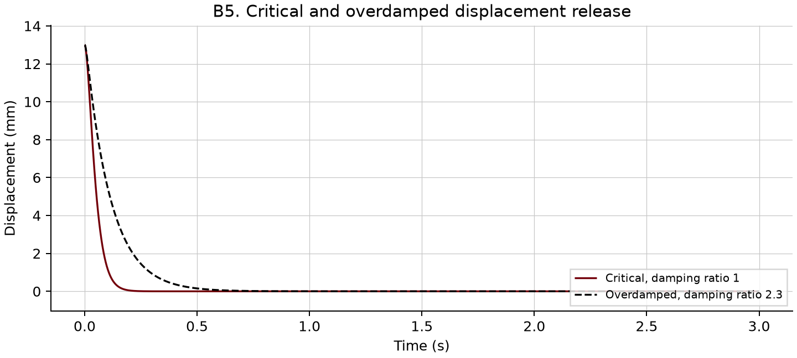{width=95%}

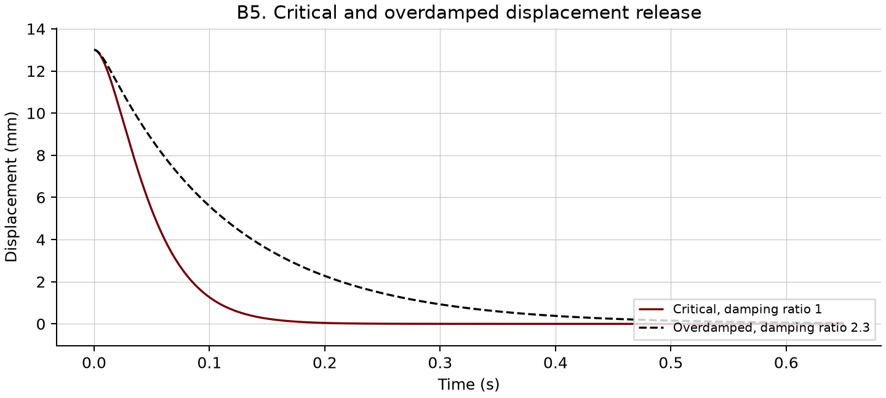{width=95%}

For this fixed mass and stiffness with an initial displacement and zero velocity, critical damping returns to equilibrium most rapidly among the nonoscillatory cases. Overdamping reduces the early displacement more slowly and introduces a long decay associated with the less-negative root. Neither response oscillates for these initial conditions.

For the race-car discussion, a critically damped single-mode model favors quick recovery without oscillatory overshoot. An overdamped model provides greater dissipation but can recover slowly and can transmit larger forces through the damper for a given relative velocity. Actual ride, road holding, and suspension travel depend on road input, tire and wheel dynamics, damping nonlinearity, and multiple modes. This one-degree-of-freedom release test cannot establish which setup is better for a complete vehicle.

## B.6. Harmonic forcing and frequency response.

Assume a fixed support, linear spring, viscous damping, a point mass, small motion, and prescribed force $F(t)$. The horizontal free-body diagram gives $F(t)-c\dot u-ku=m\ddot u$. For harmonic forcing represented by a complex exponential,

$$m\ddot u+c\dot u+ku=\hat F e^{i\omega t}.$$

Physical force and displacement are the real parts. Define $\hat f=\hat F/m$ and divide by $m$ to obtain

$$\ddot u+2\zeta\omega_n\dot u+\omega_n^2u=\hat f e^{i\omega t}.$$

The complete response is $u=u_c+u_p$. For an underdamped system, $u_c=e^{-\alpha t}[A\cos(\omega_dt)+B\sin(\omega_dt)]$. Seek a particular solution $u_p=\hat u e^{i\omega t}$. Substituting its derivatives gives

$$(-\omega^2+2i\zeta\omega_n\omega+\omega_n^2)\hat u=\hat f,$$

so

$$\hat u=\frac{\hat f}{\omega_n^2-\omega^2+2i\zeta\omega_n\omega}
=\frac{\hat F}{k-m\omega^2+ic\omega}.$$

For positive damping, the complementary response decays and is called the transient. The particular response persists at the excitation frequency and is called the steady-state response. To satisfy initial conditions, apply them to the complete solution, not to the transient alone.

Let $u_{\rm qst}=\hat F/k$. The course defines the dimensionless frequency response function (FRF) normalized by this quasi-static displacement,

$$\boxed{\mathrm{FRF}(\omega)=\frac{\hat u}{u_{\rm qst}}
=\frac{\omega_n^2}{\omega_n^2-\omega^2+2i\zeta\omega_n\omega}
=\frac{1}{1-p^2+2i\zeta p},\quad p=\frac{\omega}{\omega_n}.}$$

The physical compliance $H=\hat u/\hat F=\mathrm{FRF}/k$ is a different quantity with units of metres per newton. The distinction prevents unit errors in B.7.

The magnification factor and phase are

$$M(p)=|\mathrm{FRF}|=\frac{1}{\sqrt{(1-p^2)^2+(2\zeta p)^2}},\qquad
\phi(p)=-\operatorname{atan2}(2\zeta p,1-p^2).$$

Thus $|\hat u|=(\hat F/k)M$ and the real steady-state response to $\hat F\cos\omega t$ is $|\hat u|\cos(\omega t+\phi)$. At very low frequency, $M\to1$ and phase approaches zero. At large frequency, $M\sim1/p^2$ and phase approaches $-180^\circ$.

To find an interior amplitude peak, minimize the denominator squared,

$$Q(p)=(1-p^2)^2+4\zeta^2p^2,\qquad
\frac{dQ}{dp}=4p(p^2-1+2\zeta^2).$$

For $0<\zeta<1/\sqrt2$, the nonzero stationary point gives

$$\omega_r=\omega_n\sqrt{1-2\zeta^2},\qquad
M_r=\frac{1}{2\zeta\sqrt{1-\zeta^2}}.$$

For $\zeta\geq1/\sqrt2$, the maximum occurs at zero frequency and equals one. For zero damping, the response is unbounded at exact resonance within this ideal model.

Phase resonance means that displacement lags force by $90^\circ$. It occurs at $p=1$ for positive damping. At this frequency,

$$\mathrm{FRF}(\omega_n)=\frac{1}{2i\zeta}=-\frac{i}{2\zeta},\qquad
M_{90}=\frac{1}{2\zeta},\qquad
\hat u_{90}=-i\frac{\hat F}{2\zeta k}.$$

True amplitude resonance is a peak of the magnitude under constant force amplitude, whereas phase resonance is the quadrature condition. In the range with a finite nonzero peak,

$$\omega_r=\omega_n\sqrt{1-2\zeta^2}
<\omega_d=\omega_n\sqrt{1-\zeta^2}<\omega_n.$$

Finally, with one excitation cycle per revolution, the rotational speed is $N=60\omega/(2\pi)$ revolutions per minute, abbreviated rpm.

## B.7. Motor on a cantilever.

The inputs are $L=0.568\ \mathrm m$, $h=0.003\ \mathrm m$, $b=0.037\ \mathrm m$, $E=200\ \mathrm{GPa}$, motor mass $m=0.52\ \mathrm{kg}$, $\zeta=0.14$, $\hat F=0.012\ \mathrm N$, and operating speed $1500\ \mathrm{rpm}$. Neglect beam mass and use the weak-axis vertical bending shown in the original figure. This lumped approximation is prescribed here; a distributed beam model would need additional mass information.

Compute $I=bh^3/12$, $k=3EI/L^3$, $\omega_n=\sqrt{k/m}$, and $c=2\zeta m\omega_n$. The force-normalized limit in B.6 then gives $u_{\rm qst}=\hat F/k$.

{{B7}}

At phase resonance use $\omega=\omega_n$, $f=f_n$, and $\tau=1/f_n$. For real force $\hat F\cos(\omega_nt)$, the steady-state physical displacement is

$$u_{\rm ss}(t)=\frac{u_{\rm qst}}{2\zeta}\sin(\omega_nt).$$

Equivalently, the complex response amplitude is $\hat u_{90}=-i|\hat u_{90}|$. The assignment does not prescribe starting conditions for the phase-resonant plot, so the steady-state curve is the direct interpretation. The companion curve shows a force switched on at time zero from rest. In that case the transient must cancel the initial steady-state velocity, giving

$$u_{\rm rest}(t)=U\sin(\omega_nt)
-\frac{U\omega_n}{\omega_d}e^{-\zeta\omega_nt}\sin(\omega_dt),
\qquad U=\frac{u_{\rm qst}}{2\zeta}.$$

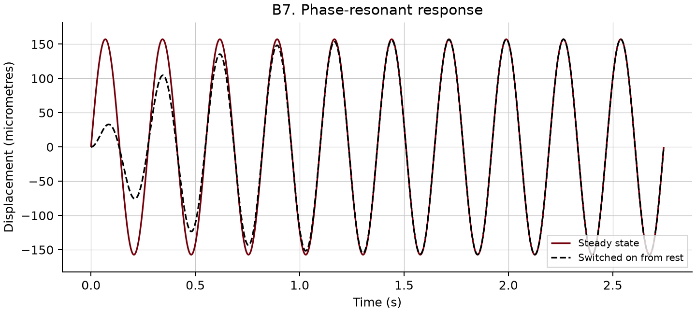{width=95%}

The requested frequency sweep uses exactly 5000 uniformly spaced points from zero to the operational frequency $f_0=25\ \mathrm{Hz}$. Data markers at the requested frequencies are calculated analytically rather than substituted by the nearest sweep sample.

{{B7_FRF}}

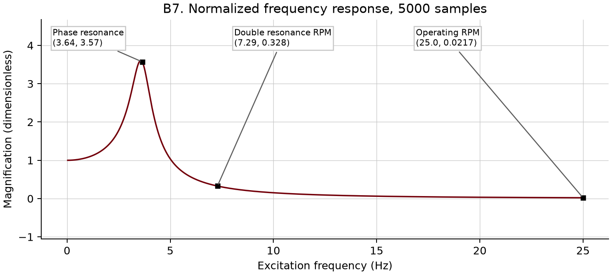{width=95%}

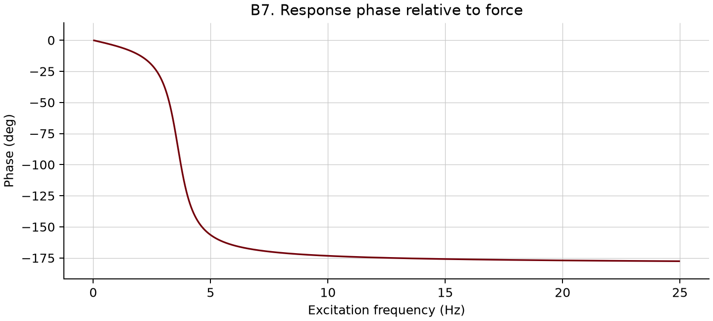{width=95%}

During a sufficiently slow run-up with the assumed constant force amplitude, the vibration grows near the response peak and falls as the operating speed moves above resonance. A rapid run-up need not reach the steady-state peak because the system takes time to build that response. An actual fixed rotating imbalance produces force proportional to speed squared, so a physical run-up prediction needs that speed dependence and an acceleration schedule. The homework supplies only one force amplitude; the plotted FRF is the structural response normalized by that force, not a complete run-up simulation.

## B.8. Horizontal flex-beam impact.

The inputs are $M=53\ \mathrm{kg}$, $m_p=0.018\ \mathrm{kg}$, $v_p=935\ \mathrm{m/s}$, $L=0.568\ \mathrm m$, $b=0.037\ \mathrm m$, $h=0.003\ \mathrm m$, and $E=200\ \mathrm{GPa}$. The original sketch has section width $h$ in the horizontal motion direction and section height $b$. Therefore the relevant moment of area is still

$$I=\frac{bh^3}{12}.$$

It is not $hb^3/12$ merely because the beam is moving horizontally. The cubed dimension is the section depth along the bending deflection. Under the short-impact lumped-mass approximation, the finite spring force has negligible impulse during the collision. Thus

$$v_0=\frac{m_pv_p}{M+m_p},\qquad k=\frac{3EI}{L^3},\qquad
\omega_n=\sqrt{\frac{k}{M+m_p}}.$$

With zero displacement immediately after impact, the response is again $u=(v_0/\omega_n)\sin(\omega_nt)$. The first largest positive response is at $\tau/4$.

{{B8}}

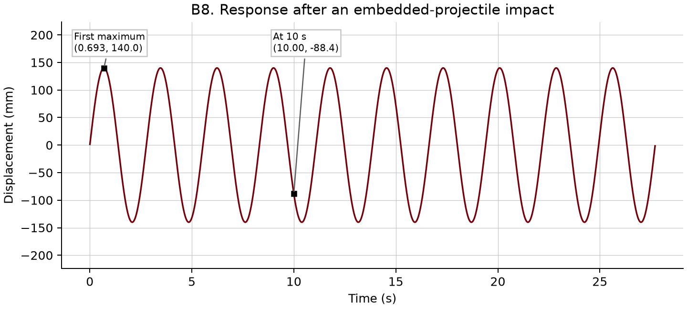{width=95%}

The predicted amplitude is a substantial fraction of the span. It should be reported as the requested linear-model result rather than an accurate large-deflection prediction. Beam inertia, local impact deformation, geometric nonlinearity, and damping are absent from this model.

# C. Optional challenge problems.

## C.1. Why gravity disappears after shifting the origin.

Let the downward coordinate $y$ be measured from the spring's unstretched position. The weight is $W=mg$. At static equilibrium the upward spring force balances the weight,

$$mg-k\delta_{\rm st}=0,\qquad \delta_{\rm st}=\frac{mg}{k}.$$

During vibration, write $y=\delta_{\rm st}+u$, where $u$ is the displacement from static equilibrium. The upward spring force is $k(\delta_{\rm st}+u)$, so

$$m\ddot u=mg-k(\delta_{\rm st}+u)
=(mg-k\delta_{\rm st})-ku=-ku.$$

Consequently $m\ddot u+ku=0$, just as in B.1. Gravity still causes the static stretch; it disappears only from the incremental equation around that equilibrium.

For a force of magnitude $F$ making angle $\theta$ with downward vertical, its component along the allowed coordinate is $F\cos\theta$. A constant uniform component only shifts equilibrium. If an added force component depends on time or position, it generally remains in the equation. With equilibrium $y_e$ satisfying $ky_e=mg+F_y(y_e)$,

$$m\ddot u+ku=F_y(y_e+u,t)-F_y(y_e).$$

If the field is time independent and differentiable, linearization gives $m\ddot u+[k-F_y'(y_e)]u=0$. The perpendicular component is carried by constraints only under the assumed one-coordinate model. This distinction is why an arbitrary force field cannot always be removed as a constant load.

## C.2. Vertical bending of a cantilever with a tip mass.

Use the rectangular section with vertical depth $h$ and width $b$. Assuming small elastic bending of a uniform massless cantilever,

$$I=\frac{bh^3}{12},\qquad EI=E\frac{bh^3}{12},\qquad
k=\frac{3EI}{L^3}.$$

At the tip, weight $mg$ acts downward and the beam reaction $k\delta_{\rm st}$ acts upward. Their balance gives $\delta_{\rm st}=mg/k$. During vibration the upward beam force is $k(\delta_{\rm st}+u)$. The same subtraction as in C.1 gives

$$m\ddot u+ku=0,\qquad \omega_n=\sqrt{\frac{3EI}{mL^3}}.$$

The normalized dynamic equation is identical to the horizontal-beam equation in C.3–C.4. The differences are the static offset and, when the section is rotated, which moment of area applies. The homework's C.4 cross-reference points to a numerical application; C.3 is the corresponding analytical derivation. For an arbitrary oblique field, project its component onto the bending direction and apply the equilibrium and linearization argument from C.1.

## C.3. Horizontal cantilever and arbitrary initial conditions.

In the original sketch, the section dimension along motion is $h$ and the perpendicular dimension is $b$. Thus $I=bh^3/12$ and $k=3EI/L^3$. On the free-body diagram, the horizontal elastic reaction is $-ku$. Weight is balanced by the beam's vertical support reaction about the static configuration, while the reduced horizontal dynamics satisfy

$$m\ddot u=-ku,\qquad \ddot u+\frac{3EI}{mL^3}u=0.$$

The equation has the same form as B.1. Define $\omega_n=\sqrt{3EI/(mL^3)}$ and impose the initial displacement and velocity to obtain

$$u(t)=u_0\cos(\omega_nt)+\frac{v_0}{\omega_n}\sin(\omega_nt).$$

This assumes negligible coupling between horizontal motion and the static vertical deflection.

## C.4. Horizontal cantilever displacement release.

The inputs are $m=5.35\ \mathrm{kg}$, $L=0.568\ \mathrm m$, $h=0.003\ \mathrm m$, $b=0.037\ \mathrm m$, $E=200\ \mathrm{GPa}$, $u_0=5.4\ \mathrm{mm}$, and $v_0=0$. Apply C.3 and evaluate

$$u(t)=0.0054\cos(\omega_nt)\ \mathrm m.$$

{{C4}}

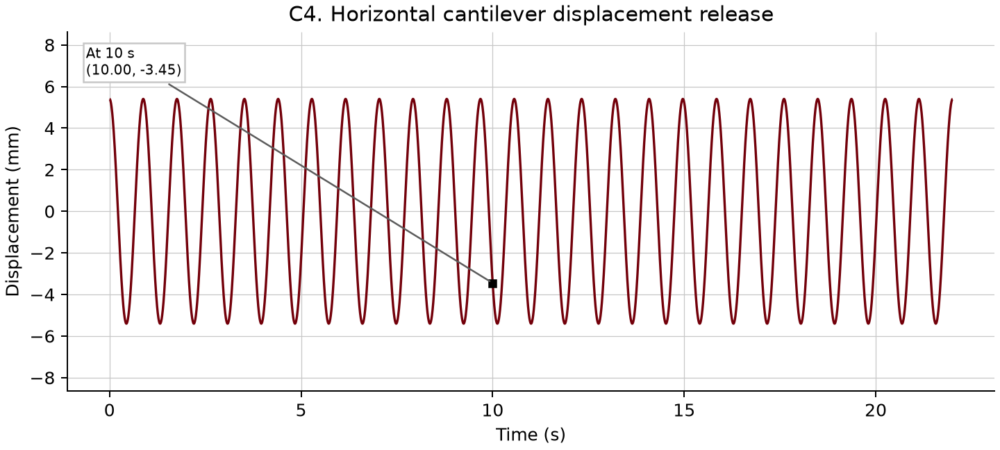{width=95%}

The maximum absolute displacement remains $5.4\ \mathrm{mm}$ because damping was not included. The response starts at a positive maximum, so a negative value at ten seconds is simply a later phase of the same oscillation.

## C.5. A suddenly applied load doubles the static displacement.

Assume the B.1 model with a prescribed force $F(t)$. The free-body diagram gives $m\ddot u=F(t)-ku$, so

$$m\ddot u+ku=F(t).$$

The general response is $u=u_c+u_p$, with $u_c=A\cos(\omega_nt)+B\sin(\omega_nt)$. For a constant load $F_0$ switched on at time zero and held thereafter, a constant particular solution satisfies $ku_p=F_0$, so $u_p=F_0/k$.

Before release the mass is at rest at the unloaded position. Thus $u(0)=0$ and $\dot u(0)=0$, giving $A=-F_0/k$ and $B=0$. The complete response for nonnegative time is

$$\boxed{u(t)=\frac{F_0}{k}[1-\cos(\omega_nt)].}$$

The static displacement is $u_{\rm st}=F_0/k$. The first maximum occurs when $\cos(\omega_nt)=-1$, at $t=\pi/\omega_n$, and equals $u_{\max}=2F_0/k=2u_{\rm st}$.

Physically, the mass passes through static equilibrium with nonzero velocity. It continues until the spring has stored all the work done by the load. The turning-point energy balance $\tfrac12ku_{\max}^2=F_0u_{\max}$ independently yields the same nonzero root. A suddenly applied load is a step input, not an impulse.

## C.6. Weight released on an initially undeformed cantilever.

The inputs are $L=0.568\ \mathrm m$, $m=5.35\ \mathrm{kg}$, $E=200\ \mathrm{GPa}$, $h=0.003\ \mathrm m$, $b=0.037\ \mathrm m$, $g=9.81\ \mathrm{m/s^2}$, and yield stress $Y=710\ \mathrm{MPa}$. The mass is already attached at rest to the undeflected tip before release. There is no drop height or impact velocity in this model.

Use $I=bh^3/12$, $k=3EI/L^3$, $\omega_n=\sqrt{k/m}$, and $F_0=mg$. A gradual release gives $u_{\rm st}=mg/k$. A sudden release gives $u(t)=(mg/k)[1-\cos(\omega_nt)]$ from the unloaded position.

For the graduate stress calculation, the static root moment is $M_{\rm root}=F_0L$. The outer-fibre distance is $h/2$, giving

$$\sigma_{\rm st}=\frac{F_0L(h/2)}{I}.$$

At the dynamic maximum, the elastic restoring tip force is $ku_{\max}=2F_0$. For the assumed massless elastic beam, the root moment and bending stress are therefore doubled,

$$\sigma_{\rm dyn}=2\sigma_{\rm st},\qquad
\mathrm{SF}_{\rm st}=\frac{Y}{\sigma_{\rm st}},\qquad
\mathrm{SF}_{\rm dyn}=\frac{Y}{2\sigma_{\rm st}}.$$

{{C6}}

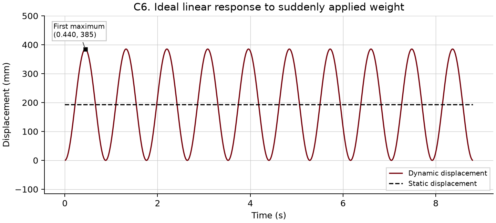{width=95%}

The dynamic safety factor is below one, so the linear elastic stress calculation predicts that yielding would occur. In addition, the predicted deflection is large relative to the beam length. Once yielding or geometric nonlinearity matters, the elastic stiffness and sinusoidal solution are no longer quantitatively reliable. The appropriate conclusion is that the given ideal model flags a problem, not that the plotted large-amplitude motion is an accurate prediction of the real beam.

## C.7. Flex-beam pendulum using the course-note model.

For a rectangular section with $b>h$, the minor and major second moments of area are

$$I_1=\frac{bh^3}{12},\qquad I_2=\frac{hb^3}{12}.$$

Use $I_1$ for the stated weak-axis motion. Page 252 combines the cantilever stiffness $k=3EI_1/L^3$ with a small-angle gravitational restoring term. The angle used there is the beam-tip slope, not the straight-line pendulum angle $u/L$. For the assumed static tip-load bending shape,

$$u=\frac{PL^3}{3EI_1},\qquad
\theta=\frac{PL^2}{2EI_1},\qquad
\frac{\theta}{u}=\frac{3}{2L}.$$

The note's projected force balance is $-ku-mg\theta=m\ddot u$. With $\theta\approx3u/(2L)$, it gives

$$m\ddot u+\left(k+\frac{3mg}{2L}\right)u=0,\qquad
\boxed{\omega_{n,\rm FBP}=\sqrt{\frac{3EI_1}{mL^3}+\frac{3g}{2L}}.}$$

The governing equation is $\ddot u+\omega_{n,\rm FBP}^2u=0$, so its general solution is $A\cos(\omega_{n,\rm FBP}t)+B\sin(\omega_{n,\rm FBP}t)$. The initial-value response is

$$u(t)=u_0\cos(\omega_{n,\rm FBP}t)
+\frac{v_0}{\omega_{n,\rm FBP}}\sin(\omega_{n,\rm FBP}t).$$

This section reproduces the course's reduced approximation. It assumes a fixed beam shape, small slope, negligible beam mass, and no damping. It is not an exact tensioned-beam solution. In particular, the $3g/(2L)$ coefficient follows from the specific tip-slope force projection on page 252 and should not be silently replaced by the ordinary pendulum value $g/L$. A continuum or energy-consistent beam treatment can give a different gravitational stiffness and lies outside this reduced homework model.

For bending about the major axis, substitute $I_2$ for $I_1$ everywhere in the elastic term. Its bending stiffness is larger by $(b/h)^2$, so its frequency is higher. Because the gravity term is additive, the total frequency ratio is not simply $b/h$ unless elastic stiffness dominates both cases.

## C.8. Flex-beam pendulum impact.

The inputs are $L=0.568\ \mathrm m$, $M=42\ \mathrm{kg}$, $m_p=0.018\ \mathrm{kg}$, $v_p=935\ \mathrm{m/s}$, $E=200\ \mathrm{GPa}$, $h=0.003\ \mathrm m$, $b=0.037\ \mathrm m$, and $g=9.81\ \mathrm{m/s^2}$. The specified projectile orientation excites the minor axis.

Use the same short-duration collision assumption as B.8. Calculate the post-impact velocity from $v_0=m_pv_p/(M+m_p)$, then insert the total mass into the C.7 frequency,

$$\omega_{n,\rm FBP}=\sqrt{\frac{k}{M+m_p}+\frac{3g}{2L}},\qquad
u(t)=\frac{v_0}{\omega_{n,\rm FBP}}\sin(\omega_{n,\rm FBP}t).$$

{{C8}}

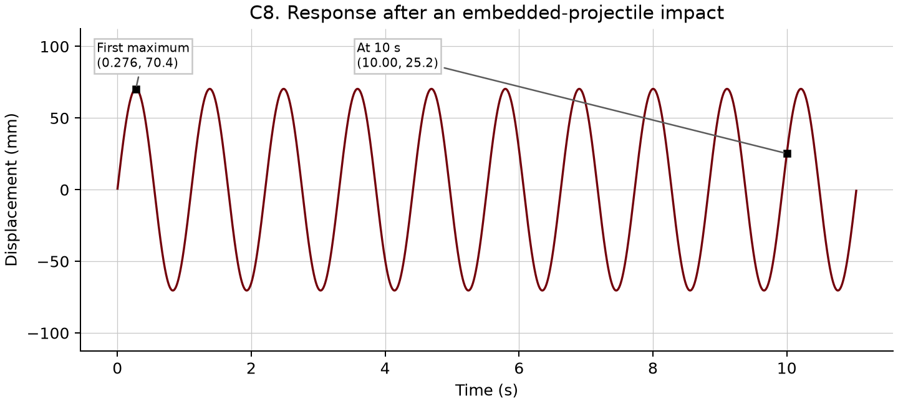{width=95%}

Compared with A.3, this case has an added elastic restoring term and the different geometric gravity approximation. It also has different length, target mass, projectile mass, and projectile speed, so the numerical comparison does not isolate beam stiffness alone. The calculated post-impact speeds happen to be similar. Within the respective homework models, the larger flex-beam pendulum frequency then produces a smaller displacement amplitude and a shorter period. The pointwise values at ten seconds also depend on phase and should not be used alone as an amplitude comparison.

## C.9. Complex numbers and phase.

Write a complex number of unit magnitude as $z=e^{i\theta}$. Then $z^4=1$ requires $4\theta=2\pi n$. The four distinct roots are

$$z_n=e^{in\pi/2},\qquad n=0,1,2,3,$$

which are $1$, $i$, $-1$, and $-i$. Euler's formula is

$$e^{i\omega t}=\cos(\omega t)+i\sin(\omega t).$$

Define the requested signal phase difference as the phase of the second signal minus the phase of the first. A positive value means that the second sinusoid leads the first. For the three signal pairs, the answers are respectively

$$\Delta\phi_a=\frac{3\pi}{4}=135^\circ,$$

$$\Delta\phi_b=\frac{3\pi}{4}-\frac{\pi}{3}
=\frac{5\pi}{12}=75^\circ,$$

$$\Delta\phi_c=115^\circ-45^\circ=70^\circ=\frac{7\pi}{18}.$$

The phases of $e^{i\pi/2}$, $e^{i3\pi/2}$, $e^{i\pi/4}$, $e^{-i\pi/2}$, and $e^{-i\pi/4}$ are $\pi/2$, $3\pi/2$, $\pi/4$, $-\pi/2$, and $-\pi/4$, respectively, or $90^\circ$, $270^\circ$, $45^\circ$, $-90^\circ$, and $-45^\circ$. The principal phase of $e^{i3\pi/2}$ is $-90^\circ$, and that point coincides with $e^{-i\pi/2}$. Angles differing by a full revolution represent the same complex number.

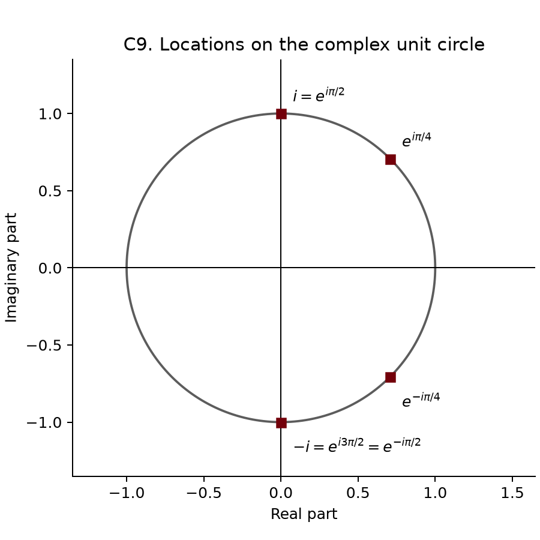{width=70%}

Finally, for $Z=4+5i$,

$$|Z|=\sqrt{4^2+5^2}=\sqrt{41}\approx6.40,\qquad
\arg Z=\operatorname{atan2}(5,4)\approx51.3^\circ.$$

# Python workflow and verification.

Python is useful here because the same equations can produce the numerical tables, exact event markers, static figures, and interactive plots. NumPy evaluates arrays of times and frequencies. SciPy solves the final band-crossing equation and independently integrates the equations of motion. Matplotlib produces the report figures, while Plotly supplies hover data tips and zooming in the offline `output/interactive.html` companion.

The Python figures in this package implement the express request to use Python plotting for this assignment. They use the specified garnet, black, and contrasting accent palette, square callout boxes, and line styles that remain distinguishable in grayscale. Physical displacement is shown in engineering units. The dimensionless FRF retains its actual magnification values rather than being rescaled to one.

For a normalized displacement plot, use $u_{\rm norm}(t)=u(t)/\max|u(t)|$ over the stated interval and label it as dimensionless. Do not normalize by the largest positive sample when a negative extremum could have the larger magnitude. Do not independently normalize the healthy and worn responses if the purpose is to compare their physical amplitudes.

Run the following commands from the `study` directory to reproduce the package. The PDF build also requires Pandoc and XeLaTeX.

```sh
uv sync
uv run ruff format .
uv run ruff check . --fix
uv run ty check .
uv run python build.py
```

The inputs are centralized in `inputs.json`. Edit `solutions_source.md` for explanatory changes. The builder writes the calculated `solutions.md`, `output/results.json`, the A.2 CSV table, figures, the offline interactive companion, and `output/pdf/HW01_worked_solutions.pdf`. The dependency versions are pinned in `uv.lock`.

Verification compares the analytical free responses with independent numerical integration, including both underdamped and nonoscillatory cases. It also compares the complete B.7 forced response against numerical integration, verifies the impact momentum balances and the C.6 turning-point energy balance, and checks that each reported final 2% crossing is followed only by motion inside the band. Numerical verification checks the implementation of a model; it does not establish the physical validity of that model's assumptions.

The relevant official implementation documentation is [SciPy initial-value integration](https://docs.scipy.org/doc/scipy/reference/generated/scipy.integrate.solve_ivp.html) and [Plotly offline interactive HTML export](https://plotly.com/python/interactive-html-export/). Course sources and these implementation references are recorded in the centralized `references.bib` file.

The assignment mentions MATLAB code for partial credit and asks for data tips. The Python companion supplies reproducible calculations and equivalent interactive data tips, but the provided documents do not explicitly establish that Python code is accepted in place of MATLAB for submission. The mathematics and figures are ready to study; code-format acceptance remains an instructor decision.
